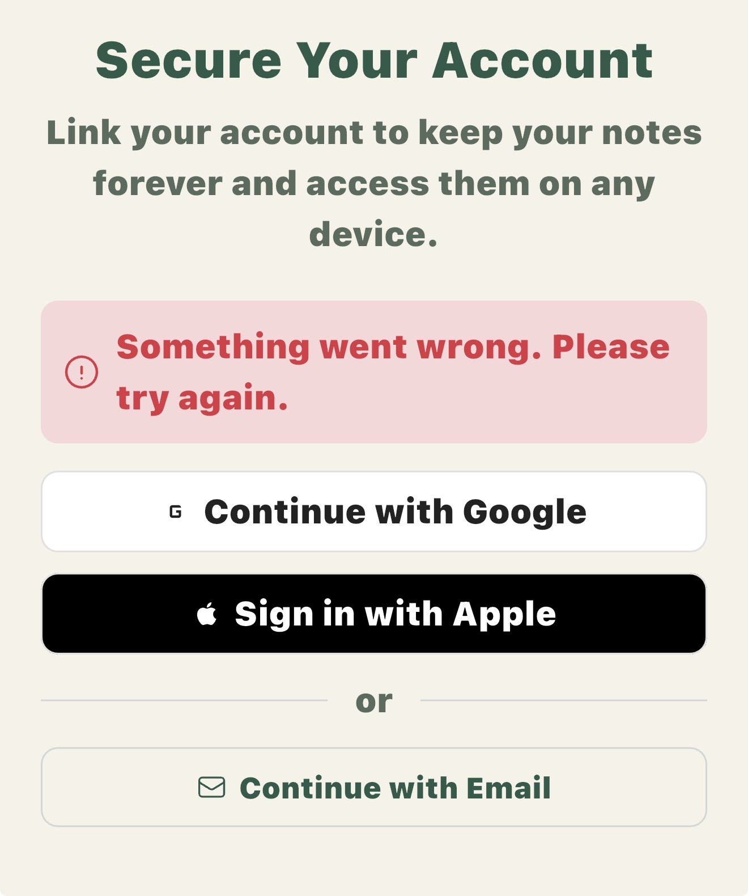
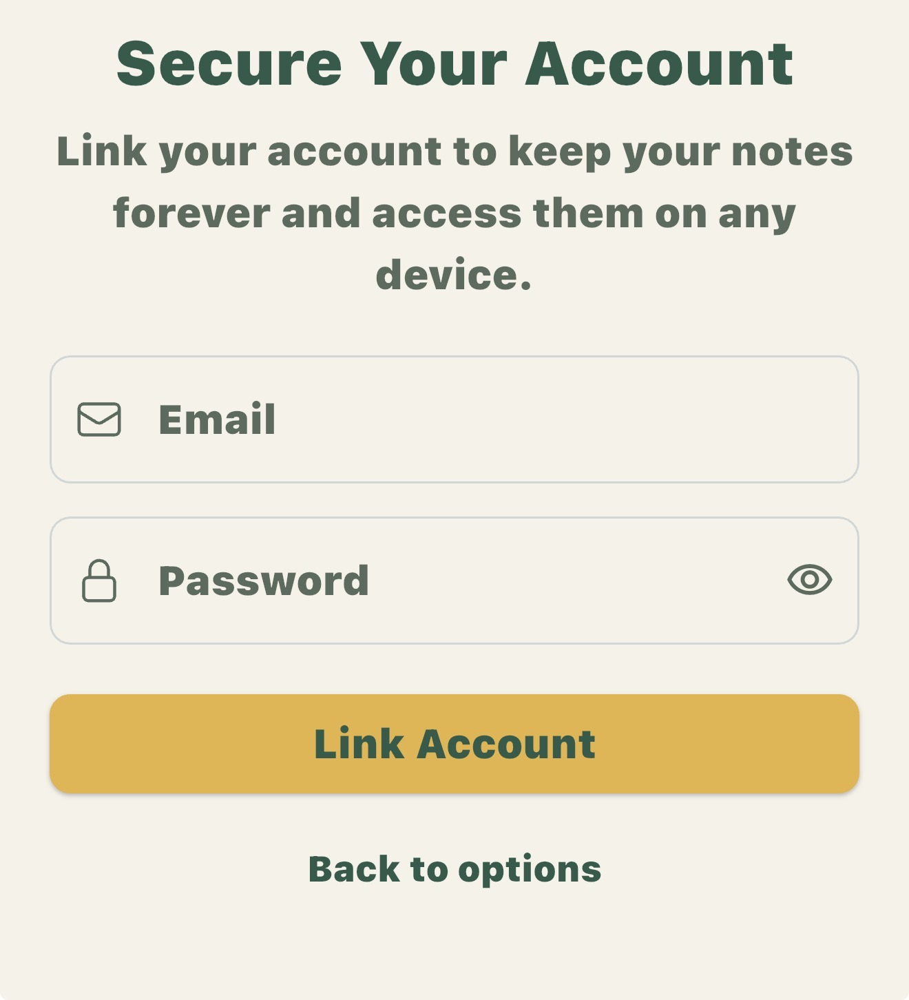
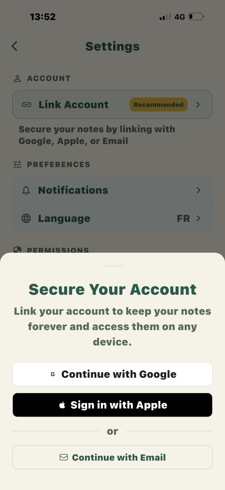

<div align="center">

# 🔐 LayouAuth

**Stop blocking users. Start building trust.**

A Flutter authentication module that lets users experience your app first, authenticate later.

[](https://pub.dev/packages/layou_auth)
[](https://pub.dev/packages/layou_auth/score)
[](https://pub.dev/packages/layou_auth/score)
[](https://opensource.org/licenses/MIT)

[Why LayouAuth?](#-why-layouauth) • [Quick Start](#-quick-start) • [Screenshots](#-screenshots) • [Examples](#-examples) • [Docs](#-documentation)

</div>

---

## 🎯 Why LayouAuth?

> **This README is for everyone** - designers, product managers, and developers. We talk UX strategy first, implementation second.

### The Problem: 40% Drop-off at Login

For years, apps forced users to "Sign up" before even seeing the first screen.

**The truth: people want to TRY, not fill forms.**

Every authentication step between download and your app's "aha moment" is a leak in your funnel.

### The LayouAuth Philosophy

This isn't just a package. It's a **UX mindset** + technical implementation.

**For designers & product people:**
LayouAuth removes the biggest friction point in mobile apps. It's built on the belief that users should experience your app's value before you ask for their trust.

**For developers:**
Stop writing Firebase Auth boilerplate. Get a production-ready auth system with beautiful UI in minutes. No boilerplate. No complexity. Just authentication that works.

**For everyone:**
If your app requires a sign-up wall before showing any value, ask yourself: *"Am I protecting my users, or protecting myself from admitting my onboarding isn't compelling enough?"*

Anonymous-first auth forces you to build something worth coming back to.

### 🎭 Real-world UX Strategies

Here's what teams are testing in production:

#### Anonymous-first (recommended by layou_auth)
**The approach:**
- Users start anonymous by default
- Multiple CTAs throughout the app to link their account
- Prompt linking after meaningful engagement (post-paywall, after first save, etc.)

**The results:**
- Zero friction at launch → higher conversion
- Users experience the "aha moment" before committing
- Natural filter: if users don't want to link, the app didn't deliver value

**Pro tip:** For paid users, require account linking post-purchase. Anonymous + payment works for the initial conversion, but linking ensures they can restore purchases and access across devices.

#### 📧 Email-only
**The reality:** It can feel restrictive, but if your app truly delivers value, retention stays strong. Some older apps still use this successfully.

#### 🍎 Apple/Google only
**The experiment:** Radical but clean. Removes choice paralysis, but be aware:
- Users might use "Hide My Email" with Apple Sign-In
- You'll get private relay emails like `abc123@privaterelay.appleid.com`
- It works, but plan for anonymous email addresses

**The pattern that emerges:** The best apps let users reach value instantly, then earn the right to ask for commitment.

---

## ✨ What You Get

<table>
<tr>
<td width="50%">

### ❌ Without LayouAuth

```dart
// 500+ lines of boilerplate
class AuthService {
  Future<void> signInWithGoogle() async {
    try {
      final googleUser = await GoogleSignIn().signIn();
      if (googleUser == null) return;
      final googleAuth = await googleUser.authentication;
      final credential = GoogleAuthProvider.credential(
        accessToken: googleAuth.accessToken,
        idToken: googleAuth.idToken,
      );
      await FirebaseAuth.instance.signInWithCredential(credential);
    } on FirebaseAuthException catch (e) {
      // Handle errors...
    }
  }
  // + 400 more lines for Apple, Email, linking...
}

// Then build UI from scratch
// Handle states, errors, loading...
// Wire up Riverpod...
```

</td>
<td width="50%">

### ✅ With LayouAuth

```dart
// Initialize once
void main() async {
  LayouAuth.initialize(
    config: LayouAuthConfig(
      providers: [
        GoogleProviderConfig(iosClientId: '...'),
        const AppleProviderConfig(),
        const EmailProviderConfig(),
      ],
    ),
  );
  runApp(const ProviderScope(child: MyApp()));
}

// Use anywhere
LayouAuthSheet.show(context, mode: LayouAuthMode.signIn);
```

**That's it.** Sign-in, linking, errors, loading states, UI—all handled.

</td>
</tr>
</table>

### Features for Product & UX Teams
- 🎯 **Instant engagement** - Users reach your app's value in seconds, not after a form
- 📊 **Built-in conversion funnel** - Anonymous → engaged → linked = clear value signal
- 🧪 **A/B test ready** - Test different linking prompts and timings
- 💡 **Progressive trust building** - Earn the right to ask for commitment

### Features for Developers
- 🚀 **Ready-to-use UI** - Beautiful bottom sheets, inline sections, and individual buttons. Dark mode included.
- 🔗 **Account Linking** - Convert anonymous users to permanent accounts seamlessly
- 🧩 **Riverpod Integration** - Providers for auth state, user info, and actions. No setup needed.
- 🎨 **Fully Customizable** - Override strings, theme, or build your own UI with the builder API
- 🛡️ **Type-safe Errors** - No more catching `FirebaseAuthException` and parsing codes
- 🌍 **i18n Ready** - All strings customizable. Use your own translation system

### 🎯 Supported Auth Methods

| Provider | Sign In | Link Account | Status |
|----------|---------|--------------|--------|
| 🔗 Anonymous | ✅ | — | Built-in |
| 🌐 Google | ✅ | ✅ | Fully supported |
| 🍎 Apple | ✅ | ✅ | iOS/macOS |
| 📧 Email/Password | ✅ | ✅ | Fully supported |

### 🆕 Latest Enhancements

- **🗑️ Account Deletion** with automatic reauthentication
- **🔄 Smart Credential Handling** - If a provider is already linked elsewhere, offer to sign in
- **🧪 Debug Mode** - Long-press email field for test credentials
- **🎣 Lifecycle Callbacks** - Run code before/after sign-out or deletion

---

## 📸 Screenshots

### 🔗 Account Linking Flow

<div align="center">

| Profile with Badge | Link Options Sheet | Email Form | Settings Integration |
|:---:|:---:|:---:|:---:|
|  |  |  |  |
| User profile showing "Linked account" badge and "Link my account" button | Clean bottom sheet with Google, Apple, and Email options | Expandable email/password form with validation | Settings page with "Link Account" entry and "Recommended" badge |

</div>

### 🎨 What You Get Out of the Box

- ✅ **Beautiful bottom sheets** with handle bar and rounded corners
- ✅ **Smart error handling** with inline error messages
- ✅ **Loading states** with spinners on buttons
- ✅ **Expandable forms** for email/password
- ✅ **Native platform look** (Apple button black on iOS)
- ✅ **Dark mode support** automatically
- ✅ **Consistent spacing** and typography
- ✅ **Accessible** with proper labels

---

## ⚡ Quick Start

### 1️⃣ Install

```bash
flutter pub add layou_auth
```

### 2️⃣ Initialize

```dart
import 'package:layou_auth/layou_auth.dart';

void main() async {
  WidgetsFlutterBinding.ensureInitialized();
  await Firebase.initializeApp(options: DefaultFirebaseOptions.currentPlatform);

  LayouAuth.initialize(
    config: LayouAuthConfig(
      providers: [
        GoogleProviderConfig(iosClientId: DefaultFirebaseOptions.ios.iosClientId),
        const AppleProviderConfig(),
        const EmailProviderConfig(),
      ],
    ),
  );

  runApp(const ProviderScope(child: MyApp()));
}
```

### 3️⃣ Use

```dart
// Show auth bottom sheet
LayouAuthSheet.show(context, mode: LayouAuthMode.signIn);
```

**That's it!** 🎉 You have a complete auth system.

### 📝 When to Prompt Account Linking

```dart
// ✅ After a purchase (they paid, they see the value)
void onPurchaseComplete() {
  LayouAuthSheet.show(
    context,
    mode: LayouAuthMode.link,
    strings: LayouAuthStrings(
      linkAccountTitle: "Secure your purchase!",
      linkAccountSubtitle: "Link your account to access on all devices.",
    ),
  );
}

// ✅ After meaningful engagement (they're invested)
void onFirstContentCreated() {
  if (LayouAuth.currentUser?.isAnonymous == true) {
    LayouAuthSheet.show(context, mode: LayouAuthMode.link);
  }
}

// ❌ On app launch (they haven't seen value yet)
void initState() {
  // DON'T: Force login wall before showing any value
  // DO: Let them explore anonymously, prompt later
}
```

---

## 💡 Examples

### Sign In

```dart
LayouAuthSheet.show(
  context,
  mode: LayouAuthMode.signIn,
  onSuccess: (user, method) {
    print('Signed in with ${method.name}: ${user.email}');
  },
);
```

### Link Anonymous Account

```dart
// Perfect for converting free users to permanent accounts
LayouAuthSheet.show(
  context,
  mode: LayouAuthMode.link,
  onSuccess: (user, method) {
    ScaffoldMessenger.of(context).showSnackBar(
      SnackBar(content: Text('Account linked with ${method.name}!')),
    );
  },
);
```

### Settings Page Integration

```dart
// In your settings page
Card(
  child: ListTile(
    leading: const Icon(Icons.link),
    title: const Text('Link Account'),
    subtitle: const Text('Secure your notes by linking with Google, Apple, or Email'),
    trailing: const Chip(label: Text('Recommended')),
    onTap: () => LayouAuthSheet.show(context, mode: LayouAuthMode.link),
  ),
)
```

### Delete Account with Confirmation

```dart
// New! With automatic reauthentication
ElevatedButton(
  onPressed: () async {
    final confirmed = await LayouDeleteAccountSheet.show(
      context,
      title: 'Delete Account?',
      message: 'This will permanently delete your data.',
      onBeforeDelete: () async {
        // Delete user documents
        await firestore.collection('users').doc(userId).delete();
      },
    );

    if (confirmed == true) {
      // User deleted and automatically logged out
      context.go(Routes.welcome);
    }
  },
  style: ElevatedButton.styleFrom(backgroundColor: Colors.red),
  child: const Text('Delete My Account'),
);
```

### Sign Out with Callbacks

```dart
// Clean up before/after logout
final service = ref.read(layouAuthServiceProvider);

await service.signOut(
  onBeforeLogout: () async {
    // Cancel subscriptions, clear cache, etc.
    await subscriptionService.cancelAll();
  },
  onAfterLogout: () async {
    // Navigate to home, track analytics, etc.
    analytics.logLogout();
    context.go(Routes.home);
  },
);
```

---

## 🎯 Advanced Usage

### Custom Strings (i18n)

```dart
LayouAuthSheet.show(
  context,
  mode: LayouAuthMode.link,
  strings: LayouAuthStrings(
    linkAccountTitle: t.auth.linkTitle,
    linkAccountSubtitle: t.auth.linkSubtitle,
    googleButton: t.auth.continueWithGoogle,
    appleButton: t.auth.continueWithApple,
    emailButton: t.auth.continueWithEmail,
    closeButton: t.common.close,
  ),
);
```

### Custom Theme

```dart
LayouAuthSheet.show(
  context,
  theme: LayouAuthTheme(
    buttonBorderRadius: 16.0,
    buttonSpacing: 16.0,
    googleButtonStyle: OutlinedButton.styleFrom(...),
    appleButtonStyle: ElevatedButton.styleFrom(...),
  ),
);
```

### Full Custom UI (Builder)

```dart
LayouAuthSheet.show(
  context,
  builder: (context, state, actions) {
    return YourCustomWidget(
      isLoading: state.isLoading,
      error: state.error,
      onGoogleTap: actions.linkWithGoogle,
      onAppleTap: actions.linkWithApple,
    );
  },
);
```

### Individual Buttons

```dart
LayouGoogleButton(
  label: 'Continue with Google',
  isLoading: _isLoading,
  onPressed: () async {
    final result = await ref.read(layouAuthActionsProvider.notifier).signInWithGoogle();
    result.when(
      success: (user) => print('Success: ${user.email}'),
      error: (error) => print('Error: ${error.message}'),
    );
  },
)
```

### Inline Section (Settings)

```dart
LayouAuthSection(
  title: 'Link your account',
  subtitle: 'Keep your data safe',
  showGoogle: true,
  showApple: true,
  showEmail: true,
  onSuccess: (user, method) {
    showSuccessSnackbar('Account linked!');
  },
)
```

---

## 🧪 Debug Mode Features

### Auto-fill Test Credentials

In debug mode, **long-press** the email field to generate test credentials:

```dart
LayouEmailForm(
  onSubmit: _handleSubmit,
  debugCredentialsMessage: 'Test credentials generated!', // Optional snackbar
)
```

**Result:**
- Email: `test_XXX@yopmail.com` (random number)
- Password: `azerty123`

Perfect for rapid testing without typing!

---

## 🔌 Riverpod Providers

Access auth state and actions anywhere in your app:

```dart
// Current user
final user = ref.watch(layouCurrentUserProvider);
if (user != null) {
  print('Logged in: ${user.email}');
}

// Auth state stream
ref.listen(layouAuthStateProvider, (previous, next) {
  if (next != null) {
    print('User signed in');
  }
});

// Check auth status
final isAuthenticated = ref.watch(layouIsAuthenticatedProvider);
final isAnonymous = ref.watch(layouIsAnonymousProvider);

// Check linked providers
final hasGoogle = ref.watch(layouHasGoogleProvider);
final hasApple = ref.watch(layouHasAppleProvider);
final hasEmail = ref.watch(layouHasEmailProvider);
final linkedProviders = ref.watch(layouLinkedProvidersProvider);

// Auth actions
final actions = ref.read(layouAuthActionsProvider.notifier);
await actions.signInWithGoogle();
await actions.linkWithApple();
await actions.signOut();
await actions.deleteUser();
```

---

## 🛡️ Error Handling

All errors are **type-safe**. No more parsing Firebase error codes!

```dart
final result = await actions.signInWithGoogle();

result.when(
  success: (user) => print('Welcome ${user.email}'),
  error: (e) => switch (e) {
    UserCancelledException() => null, // User cancelled, do nothing
    CredentialAlreadyInUseException() => showCredentialInUseDialog(),
    NetworkException() => showError('Check your connection'),
    UserNotFoundException() => showError('No account found'),
    WrongPasswordException() => showError('Incorrect password'),
    WeakPasswordException() => showError('Password too weak'),
    _ => showError('Something went wrong'),
  },
);
```

### Available Exceptions

| Exception | When it happens |
|-----------|----------------|
| `UserCancelledException` | User cancelled Google/Apple sign-in |
| `NoUserException` | No authenticated user found |
| `SignInFailedException` | Generic sign-in failure |
| `LinkingFailedException` | Generic linking failure |
| `CredentialAlreadyInUseException` | Provider already linked elsewhere |
| `EmailAlreadyInUseException` | Email already registered |
| `WeakPasswordException` | Password too weak |
| `InvalidEmailException` | Invalid email format |
| `UserNotFoundException` | User not found (sign-in) |
| `WrongPasswordException` | Incorrect password |
| `UserDisabledException` | Account disabled |
| `NetworkException` | Network error |
| `RequiresRecentLoginException` | Sensitive operation needs reauth |
| `UnknownAuthException` | Unknown error |

---

## 🚀 Smart Credential Handling

**New!** When linking a provider that's already used on another account, LayouAuth offers to sign in instead:

```dart
// User tries to link Google account
// But that Google account exists on another account
// → LayouAuth shows: "Account Already Exists. Sign in instead?"
// → User clicks "Sign In"
// → Seamlessly switches to the existing account
```

Customize the messaging:

```dart
LayouAuthSheet.show(
  context,
  mode: LayouAuthMode.link,
  credentialInUseTitle: 'Account Exists',
  credentialInUseMessage: 'This {provider} is already registered. Sign in?',
  credentialInUseSignInButton: 'Yes, Sign In',
  credentialInUseCancelButton: 'No, Thanks',
);
```

---

## 🎣 Lifecycle Hooks

Run custom code at key moments:

### Global Hooks (in config)

```dart
LayouAuth.initialize(
  config: LayouAuthConfig(
    providers: [...],
    onSignedIn: (user, method) async {
      // Create user in Firestore
      await firestore.collection('users').doc(user.uid).set({
        'email': user.email,
        'signInMethod': method.name,
        'createdAt': FieldValue.serverTimestamp(),
      });
      // Track analytics
      analytics.logSignIn(method: method.name);
    },
    onAccountLinked: (user, method) async {
      // Award bonus for linking account
      await creditsService.addBonus(5);
      analytics.logAccountLinked(method: method.name);
    },
    onSignedOut: () async {
      // Clear local cache
      await cacheService.clearAll();
    },
    onUserDeleted: (uid) async {
      // Cloud Functions handles Firestore cleanup
      // But you can do client-side cleanup here
      await localDb.clear();
    },
  ),
);
```

### Per-operation Callbacks

```dart
// Sign out
await service.signOut(
  onBeforeLogout: () async {
    // Cancel subscriptions
    await subscriptionService.cancelAll();
  },
  onAfterLogout: () async {
    // Navigate
    context.go(Routes.home);
  },
);

// Delete account
await service.deleteUser(
  onBeforeDelete: () async {
    // Delete user-specific data
    await deleteUserDocuments();
  },
  onAfterDelete: () async {
    // Analytics
    analytics.logAccountDeleted();
  },
);
```

---

## 🔧 Platform Setup

<details>
<summary><b>📱 iOS/macOS (Apple Sign-In)</b></summary>

1. **Enable capability in Xcode:**
   - Open `ios/Runner.xcworkspace`
   - Select your target → Signing & Capabilities
   - Click `+ Capability` → Add "Sign in with Apple"

2. **Configure in Apple Developer Console:**
   - Go to [Certificates, Identifiers & Profiles](https://developer.apple.com/account/resources)
   - Select your App ID → Enable "Sign in with Apple"

3. **Add to config:**
   ```dart
   const AppleProviderConfig()
   ```

</details>

<details>
<summary><b>🌐 Google Sign-In</b></summary>

1. **Add configuration files:**
   - iOS: Add `GoogleService-Info.plist` to `ios/Runner/`
   - Android: Add `google-services.json` to `android/app/`

2. **Get iOS client ID:**
   ```dart
   GoogleProviderConfig(
     iosClientId: DefaultFirebaseOptions.ios.iosClientId,
     // Or manually: 'YOUR_IOS_CLIENT_ID.apps.googleusercontent.com'
   )
   ```

3. **Enable in Firebase Console:**
   - Authentication → Sign-in method → Google → Enable

</details>

<details>
<summary><b>📧 Email/Password</b></summary>

No platform setup needed! Just enable in Firebase:

1. Firebase Console → Authentication → Sign-in method → Email/Password → Enable

2. Optional config:
   ```dart
   const EmailProviderConfig(
     passwordMinLength: 8, // Default: 6
   )
   ```

</details>

---

## 📖 Documentation

### Core Concepts

- **Sign In**: Authenticate a user (creates new session)
- **Link Account**: Attach a provider to existing anonymous user
- **Anonymous User**: Temporary user without credentials
- **Permanent User**: User with at least one auth provider linked

### Common Patterns

**1. Start Anonymous, Link Later (Freemium)**

```dart
// App start - create anonymous user
await LayouAuth.auth.signInAnonymously();

// User wants premium features - prompt to link
if (isPremiumFeature && isAnonymous) {
  LayouAuthSheet.show(
    context,
    mode: LayouAuthMode.link,
    onSuccess: (user, method) {
      enablePremiumFeatures();
    },
  );
}
```

**2. Force Link Before Action**

```dart
// User tries to save data
Future<void> saveNote() async {
  if (ref.read(layouIsAnonymousProvider)) {
    // Must link first
    final result = await LayouAuthSheet.show(
      context,
      mode: LayouAuthMode.link,
    );
    if (result != true) return; // User cancelled
  }

  // Now safe to save
  await notesService.save(note);
}
```

**3. Settings Page with Recommended Badge**

```dart
// Show "Recommended" badge if anonymous
final isAnonymous = ref.watch(layouIsAnonymousProvider);

ListTile(
  title: const Text('Link Account'),
  subtitle: const Text('Secure your data across devices'),
  trailing: isAnonymous
    ? const Chip(label: Text('Recommended'))
    : null,
  onTap: () => LayouAuthSheet.show(context, mode: LayouAuthMode.link),
)
```

---

## 🤝 Contributing

Contributions are welcome! Please read [CONTRIBUTING.md](CONTRIBUTING.md) first.

### Development Setup

```bash
# Clone the repo
git clone https://github.com/yelkamel/layou_auth.git

# Install dependencies
flutter pub get

# Run tests
flutter test

# Run example app
cd example
flutter run
```

### Reporting Issues

Found a bug? [Open an issue](https://github.com/yelkamel/layou_auth/issues) with:
- Flutter version
- Device/OS
- Steps to reproduce
- Expected vs actual behavior

---

## 📋 Roadmap

- [ ] Phone authentication
- [ ] Multi-factor authentication
- [ ] Password reset UI
- [ ] Email verification UI
- [ ] Anonymous user migration tools
- [ ] Biometric authentication
- [ ] Session management UI

---

## 🙏 Credits

Built with ❤️ by the Layou team.

Special thanks to:
- [firebase_auth](https://pub.dev/packages/firebase_auth) - The foundation
- [google_sign_in](https://pub.dev/packages/google_sign_in) - Google integration
- [sign_in_with_apple](https://pub.dev/packages/sign_in_with_apple) - Apple integration
- [riverpod](https://pub.dev/packages/riverpod) - State management

---

## 📄 License

MIT License - see [LICENSE](LICENSE) file for details.

---

## 🌟 Show Your Support

If LayouAuth saved you time, give it a ⭐️ on [GitHub](https://github.com/yelkamel/layou_auth) and a 👍 on [pub.dev](https://pub.dev/packages/layou_auth)!

---

<div align="center">

**[⬆ Back to top](#-layouauth)**

Made with ❤️ for the Flutter community

</div>
